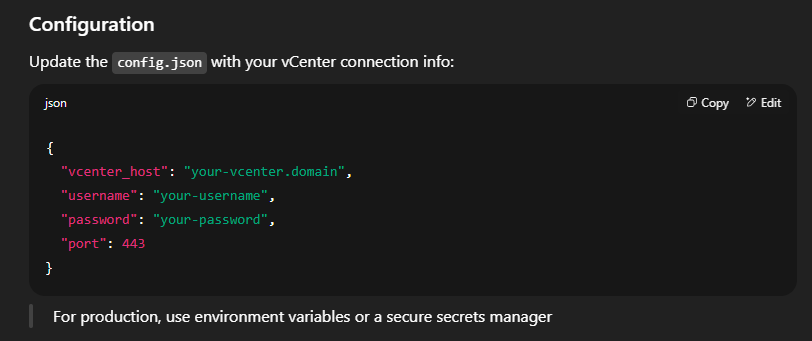

# vSphere Snapshot Management Tool

A remote Python-based GUI tool for managing VMware vSphere snapshots and virtual machines using the vCenter API.

## 🔧 Features

- Connects to **VMware vCenter** remotely using **pyVmomi**
- Built with **Python** and **PyQt6** for a modern GUI
- Uses **multithreading** to speed up data processing
- Filter, view, create, and delete snapshots
- Retrieve VM metadata (name, status, snapshot age)
- Auto-generate snapshot reports
- Manage VMs and apply autoscaling logic
- Automatically remove **leftover Veeam snapshots** to prevent storage waste

## 🧱 Architecture

- GUI interacts with backend via PyQt6
- API calls handled using pyVmomi
- Connects securely to remote vCenter
- Snapshot data is fetched, managed, and displayed in real-time
- Supports Infrastructure as Code practices

## 📸 Screenshots

> Add screenshots of the GUI and architecture diagram here

## 🚀 Getting Started

### Prerequisites

- Python 3.9+
- VMware vCenter credentials with read/write permissions
- Access to a vSphere environment



### Installation

```bash
git clone https://github.com/your-username/vsphere-snapshot-tool.git
cd vsphere-snapshot-tool
pip install -r requirements.txt
python main.py
    
